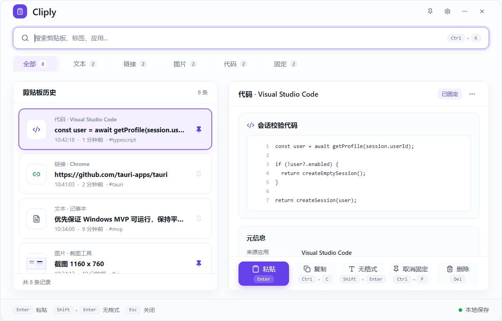

# Cliply

[English](README.md) | [简体中文](README.zh-CN.md)

Cliply 是一个面向 Windows 的本地优先剪贴板管理器，使用 Tauri v2、
React、TypeScript、Vite、Tailwind CSS、SQLite 和 Rust 构建。

它适合希望快速找回剪贴板历史，同时不想依赖账号、云服务或把剪贴板内容发送到托管服务的用户。

> 当前状态：`v0.4.0-beta.1` 发布前稳定化。核心功能已经完成，但在标记为 beta 可发布前，
> 仍需要完成真实安装器、WebDAV/FTP/FTPS、粘贴、DPI 和多显示器场景验证。



## 功能特性

- 文本、链接、代码和图片剪贴板历史
- 搜索、类型筛选、固定、删除和详情预览
- 无格式粘贴，以及自动粘贴回上一个目标窗口
- 本地 SQLite 存储
- 图片缩略图和本地图片 blob 存储
- 对密码、令牌、私钥和验证码等敏感内容进行检测
- 可配置历史保留、重复内容处理、开机行为和快捷键
- 主题设置和强调色预设
- 加密 `.cliply-sync` 同步包导出/导入
- 远程同步 provider 架构
- Local Folder、WebDAV、FTP 和 FTPS 同步 provider
- 支持保存本机同步密码的自动同步
- 现代 Windows 安装器和备用 NSIS 安装器
- 日志和诊断信息会脱敏剪贴板正文、密码、token 和大体积 payload

## 隐私模型

Cliply 采用本地优先设计：

- 剪贴板历史保存在本地应用数据目录。
- 不内置账号系统。
- 不提供托管的 Cliply 云服务。
- 同步包在导出前会加密。
- 远程同步 provider 接收的是加密同步包；启用远端图片 blob 同步时，图片 blob 上传前也会加密。
- 日志只应包含运行元数据，不应包含剪贴板正文或密钥。

默认 Windows 数据位置：

```text
%APPDATA%\com.cliply.app\
```

## 当前发布状态

最新稳定化测试结果记录在：

```text
docs/v0.4.0-beta.1-stabilization-test-results.md
```

当前自动化检查已通过：

- 前端生产构建
- Rust `cargo check`
- Rust 单元测试
- 现代安装器构建
- 日志脱敏扫描
- 1000 条本地数据性能冒烟测试

仍需人工验证的发布阻塞项：

- 全新安装、覆盖更新、自定义路径、卸载和用户数据保留
- 真实 WebDAV、FTP 和 FTPS 成功/失败路径
- 自动粘贴到真实 Windows 目标应用
- DPI 和多显示器表现
- 手动流程后的最终日志抽样

## 技术栈

- 桌面外壳：Tauri v2
- 前端：React、TypeScript、Vite、Tailwind CSS
- 图标：lucide-react
- 后端：Rust
- 存储：SQLite via `rusqlite`
- 同步加密：AES-GCM + Argon2 密钥派生
- 安装器：Tauri 应用式现代安装器，另有 NSIS 备用安装器

## 环境要求

- Windows 10/11，用于完整桌面体验
- Node.js 和 npm
- Rust stable toolchain
- Windows 上的 Tauri v2 依赖
- 构建 NSIS 包时，Tauri 会下载或使用 NSIS

## 快速开始

安装依赖：

```powershell
npm install
```

只运行前端：

```powershell
npm run dev
```

运行 Tauri 桌面应用：

```powershell
npm run tauri dev
```

构建前端：

```powershell
npm run build
```

运行后端检查：

```powershell
cargo check --manifest-path .\src-tauri\Cargo.toml
cargo test --manifest-path .\src-tauri\Cargo.toml
```

构建现代安装器：

```powershell
npm run build:modern-installer
```

现代安装器输出：

```text
apps\cliply-installer\src-tauri\target\release\cliply-modern-installer.exe
```

备用 NSIS 输出：

```text
src-tauri\target\release\bundle\nsis\Cliply_0.4.0-beta.1_x64-setup.exe
```

## 项目结构

```text
apps/cliply-installer/      现代安装器应用
docs/                       手动测试清单和稳定化报告
scripts/                    构建和打包脚本
src/                        React 前端
src-tauri/                  Rust 后端和 Tauri 配置
src-tauri/src/commands/     Tauri command handlers
src-tauri/src/db/           SQLite migrations
src-tauri/src/platform/     平台适配层
src-tauri/src/services/     剪贴板、同步、设置、日志和粘贴服务
```

## 测试

常用验证命令：

```powershell
npm run build
cargo check --manifest-path .\src-tauri\Cargo.toml
cargo test --manifest-path .\src-tauri\Cargo.toml
npm run build:modern-installer
```

定向同步测试：

```powershell
cargo test --manifest-path .\src-tauri\Cargo.toml local_folder -- --nocapture
cargo test --manifest-path .\src-tauri\Cargo.toml sync_blob -- --nocapture
cargo test --manifest-path .\src-tauri\Cargo.toml sync_crypto -- --nocapture
```

真实 FTP roundtrip 测试默认被忽略。如需运行，请提供：

```text
CLIPLY_TEST_FTP_HOST
CLIPLY_TEST_FTP_PORT
CLIPLY_TEST_FTP_USER
CLIPLY_TEST_FTP_PASSWORD
CLIPLY_TEST_FTP_SECURE
CLIPLY_TEST_FTP_REMOTE_PATH
```

## 发布检查清单

标记 beta release 前需要：

- 运行上面列出的所有自动化检查。
- 构建现代安装器。
- 验证安装器矩阵：
  - 全新安装
  - 覆盖更新
  - 自定义路径安装
  - 卸载并保留用户数据
  - 卸载并删除用户数据
  - 开机自启项行为
- 在真实环境中验证 WebDAV、FTP 和 FTPS。
- 使用 Notepad 和至少一个浏览器或编辑器输入框验证自动粘贴。
- 手动流程后重新抽样日志脱敏。
- 更新 `docs/` 中的稳定化报告。
- 面向公开分发前尽量签名 release 二进制文件。

## 安全

请不要在公开 issue 中粘贴生产密钥或敏感剪贴板内容。若发现漏洞或隐私泄漏，
请先通过私密渠道联系维护者，再公开细节。

安全敏感区域：

- 剪贴板捕获和粘贴逻辑
- 日志和诊断脱敏
- 同步包加密/解密
- 远程 provider 认证
- 安装器和更新行为

## 贡献

在仓库正式准备好公开协作后，欢迎贡献。当前建议：

1. 先创建 issue 描述 bug 或改进点。
2. 保持改动聚焦。
3. 为后端行为新增或更新测试。
4. 提交 pull request 前运行验证命令。
5. 不要提交生成产物，例如 `dist/`、`target/`、安装器 exe、payload archive 或 `node_modules/`。

## 路线图

近期：

- 完成 `v0.4.0-beta.1` 发布验证
- 完成真实 WebDAV/FTP/FTPS 测试矩阵
- 加固安装器升级和卸载流程
- 扩展粘贴和同步失败路径回归测试

后续：

- 更完善的发布自动化
- 签名 Windows 构建
- 继续加固同步 provider
- 更好的多设备冲突报告

## 许可证

当前尚未声明许可证。公开开源发布前请添加 `LICENSE` 文件；没有许可证时，其他人没有明确的法律许可来使用、修改或再分发代码。
