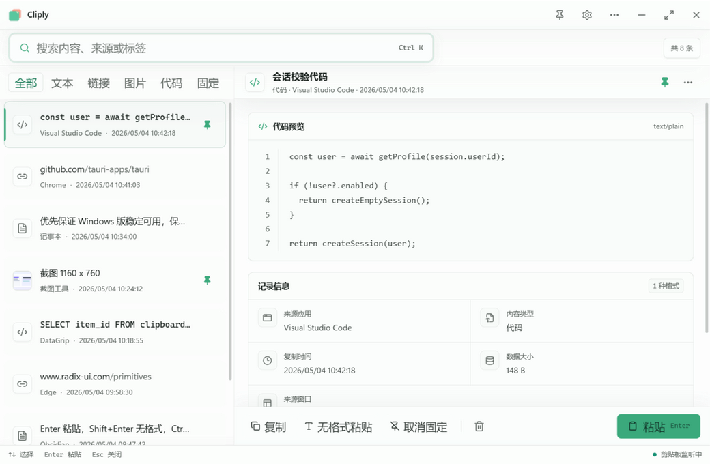
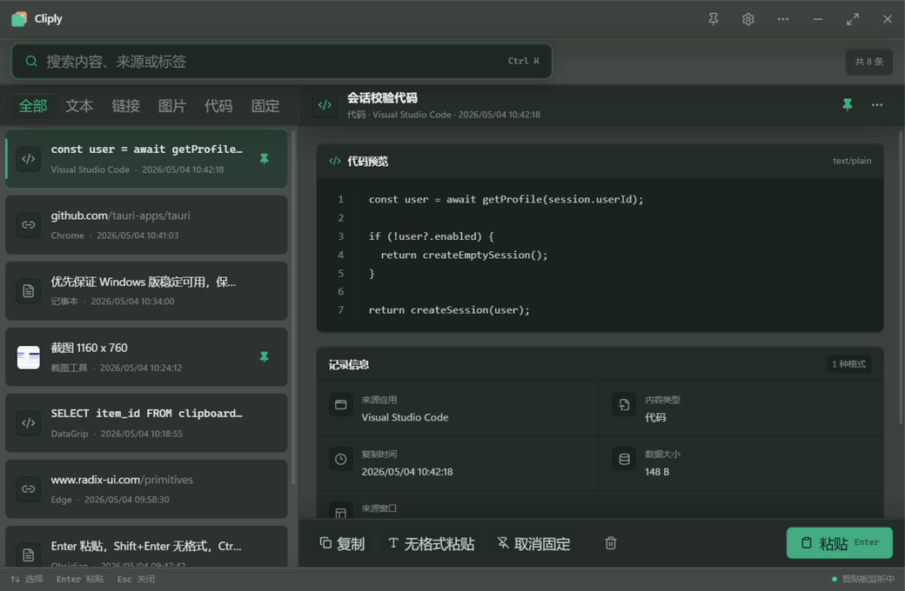
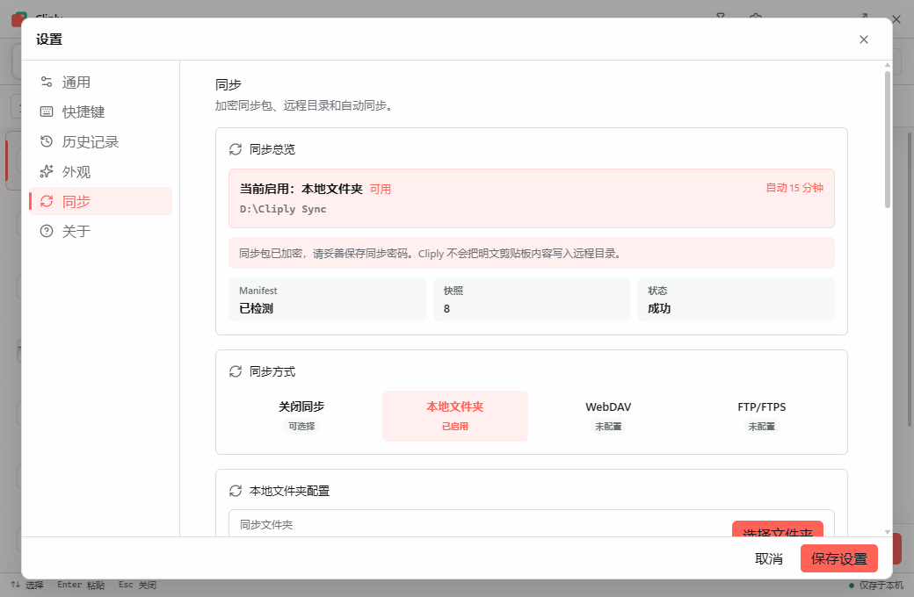

# Cliply

[English](README.md) | [简体中文](README.zh-CN.md)

Cliply 是一个面向 Windows 的本地优先剪贴板管理器。它让剪贴板历史快速、
可搜索、可控——不需要账号，也不会把剪贴板内容发送到 Cliply 托管云服务。

状态：Beta。Cliply 是 Windows-first 项目，当前重点是稳定性、安装器验证和同步可靠性。

## 截图

### 主窗口



### 深色模式



### 设置



## 功能特性

**剪贴板历史**

- 支持文本、链接、代码片段和图片
- 快速搜索、类型筛选、固定和详情预览
- 粘贴、复制、无格式粘贴，自动粘贴回上一个应用

**隐私与本地存储**

- 本地 SQLite 存储，可配置保留策略和重复内容处理
- 疑似密码、验证码等敏感内容默认脱敏保存
- 默认忽略来自常见密码管理器的复制内容（可配置）

**外观**

- 浅色 / 深色 / 跟随系统主题，强调色可自定义
- 贴近 Windows 的界面控件和系统托盘

**同步**

- 加密 `.cliply-sync` 同步包导入和导出
- 通过用户自有存储同步：本地文件夹、WebDAV、FTP 和 FTPS
- 支持可配置间隔的自动同步和图片同步模式

**安装与更新**

- Windows 安装器支持安装、更新、卸载、开机自启和用户数据保留控制
- 在“关于”页一键更新：自动下载、SHA-256 校验并启动 Modern Installer

## 快捷键

| 快捷键 | 作用 |
| --- | --- |
| `Ctrl + Shift + V` | 打开 Cliply 主窗口（全局，可配置） |
| `↑` / `↓` | 选择记录 |
| `Enter` | 粘贴所选记录 |
| `Shift + Enter` | 无格式粘贴 |
| `Ctrl + P` | 固定 / 取消固定所选记录 |
| `Delete` | 删除所选记录 |
| `Ctrl + K` | 聚焦搜索框 |
| `Esc` | 关闭窗口 |

## 隐私

Cliply 采用本地优先设计：

- 剪贴板历史保存在你的 Windows 本机。
- Cliply 不需要账号。
- Cliply 不提供、也不使用托管云服务保存你的剪贴板数据。
- 疑似密码、验证码等敏感内容默认脱敏保存。
- 同步包会在写入磁盘或上传到你配置的 provider 之前加密。
- 远程同步 provider 接收的是加密同步包，不是明文剪贴板历史。
- 检查更新只请求 GitHub Releases 的更新元数据，不会包含剪贴板历史、同步密码或本地数据库内容。
- 日志和诊断信息不得包含剪贴板正文、同步密码、provider 密码、token、
  Authorization header、private key 或图片内容。

默认 Windows 数据位置：

```text
%APPDATA%\com.cliply.app\
```

更多信息见 [PRIVACY.md](PRIVACY.md) 和
[docs/privacy-and-logs.md](docs/privacy-and-logs.md)。

## 安全

安全敏感区域包括剪贴板捕获、粘贴行为、同步包加密、远程 provider 认证、
诊断信息和安装器升级/卸载流程。

请不要在公开 issue 中粘贴生产密钥或敏感剪贴板内容。若发现安全或隐私问题，
请按照 [SECURITY.md](SECURITY.md) 处理。

## 更新

Cliply 会从 GitHub Releases 获取 `latest.json`。该清单指向 Modern
Installer 资产，并包含 SHA256 校验值。在“关于”页点击“立即更新”，Cliply
会自动下载更新包、校验 SHA-256，并以 update mode 启动 Modern Installer。
更新检查支持每天、每周自动执行，也可以手动触发。

安装阶段 Cliply 会暂时关闭，Modern Installer 会保留用户数据、覆盖程序文件、
更新快捷方式，并在完成后重新启动 Cliply。

如果自动安装失败，请从 GitHub Releases 下载完整的
`Cliply_*_x64-modern-installer.exe` 安装器手动更新。

## 开发

环境要求：Windows 10/11、Node.js 20.19+ 或 22+、Rust（MSVC 工具链）。

克隆仓库：

```powershell
git clone https://github.com/Earl9/cliply.git
cd cliply
```

安装依赖：

```powershell
npm install
```

运行桌面应用开发模式：

```powershell
npm run tauri dev
```

类型检查与构建前端：

```powershell
npm run typecheck
npm run build
```

运行后端检查：

```powershell
cargo check --manifest-path .\src-tauri\Cargo.toml
```

构建现代安装器（NSIS 备用安装器可使用 `npm run build:tauri-nsis`）：

```powershell
npm run build:modern-installer
```

## 文档

- [隐私政策](PRIVACY.md)
- [安全政策](SECURITY.md)
- [更新日志](CHANGELOG.md)
- [参与贡献](CONTRIBUTING.md)
- [安装器说明](docs/installer.md)
- [同步设计](docs/sync-design.md)
- [隐私和日志](docs/privacy-and-logs.md)

## 技术栈

- 桌面外壳：Tauri v2
- 前端：React、TypeScript、Vite、Tailwind CSS
- 后端：Rust
- 存储：SQLite via `rusqlite`
- 同步加密：AES-GCM + Argon2 密钥派生
- 安装器：Tauri 应用式现代安装器，另有 NSIS 备用安装器

## 许可证

Cliply 使用 [MIT License](LICENSE) 授权。
